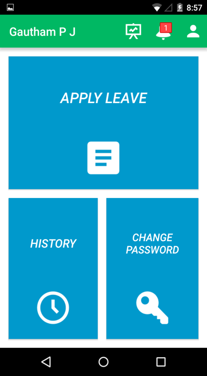
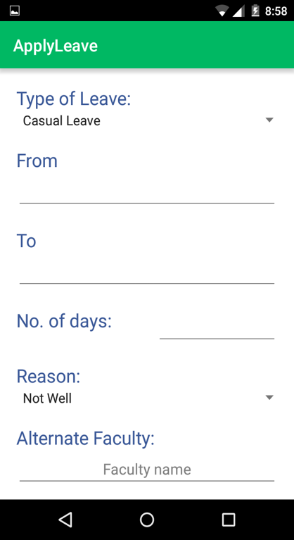
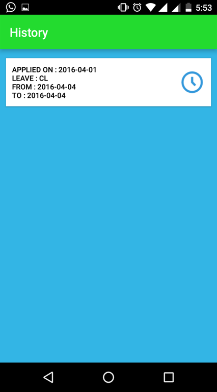
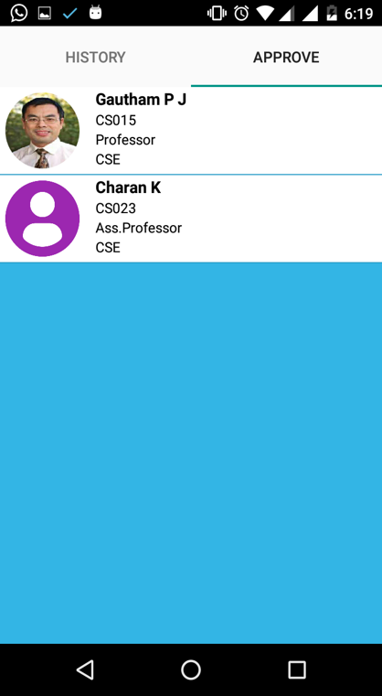
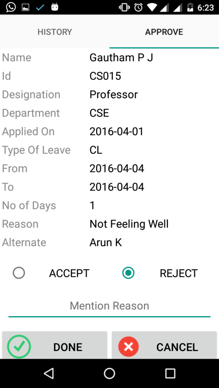
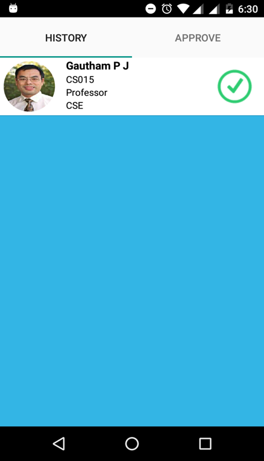
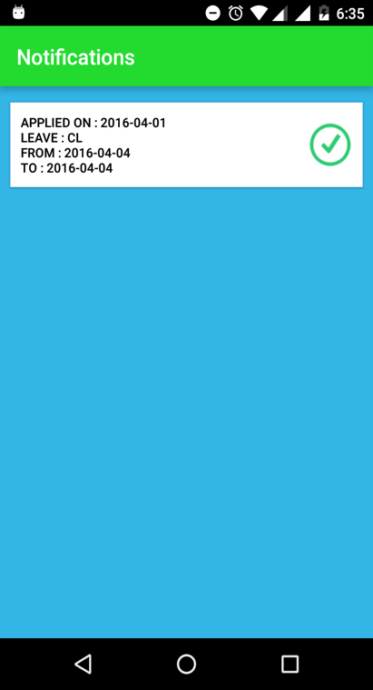
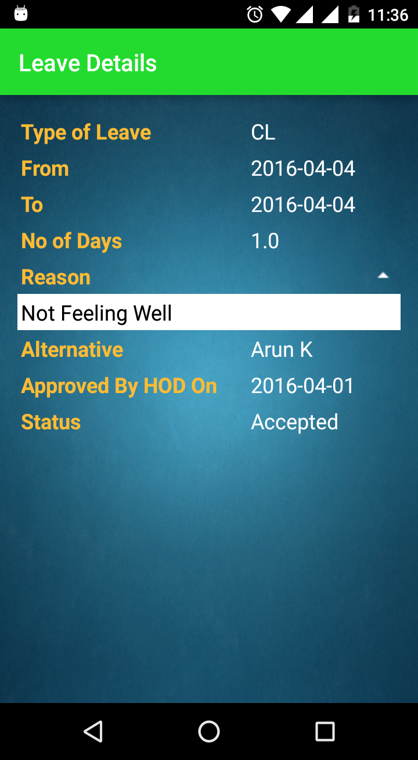
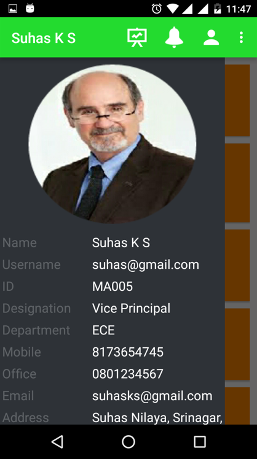
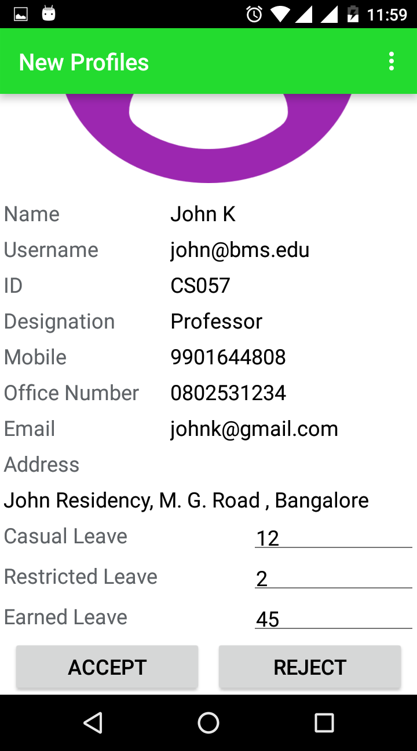

# Leave-Management-System-App
An Android application which automates the leave management process in Educational Institutions, by intelligently adapting to HR policy of the organization, decreasing paperwork and enabling the process with efficient record maintenance.

## Existing System

In the existing system many colleges follow manual procedure in which employees fill an application form and submit to the respective authorities and have to keep inquiring in the department office regarding the status. Hence it is a time consuming process. Establishment section people have to manually feed application data into computer for record maintenance. All these things make leave management, a tedious task.

## Advantages of Proposed Solution  

- apply for leave at any time, from any place.
- get instant update of application status
- maintains record of previously applied leaves
- Time efficient and does not involve paper work
- strictly follows HR policy of organization
- instant access to who are on leave today or any particular date

## Actors

1. **Staff**  
- Ex: Professor, Associate Professor, Assistant Professor etc) and Non Faculty(Librarian, Clerk, Lab Instructor etc.  
- Functionalities  
    1.To apply for leave  
    2.History : Previously applied leave applications along with status  
    3.Check leftover leaves  
    4.Get notifications for recently applied leaves   
    5.Managing profile information.  

2. **HOD**
- Functionalities
    1. Profile Approval : Approve profile of newly registered employees in the department
    2. Leave Approval : Approve leave applications of employees from his department and forward it to Vice Principal or Principal in case type of leave is RH, EL,OOD and SPCL.
    3. Faculty and Non Faculty List : View number of leaves applied and  complete profile information of all employees under his department and edit if appropriate
    4. Dashboard : View list of employees under his department, who are on leave today or any particular date
    5. Functionalities of common staff

3. **Super Admin**
- Functionalities
    1. Approve profile of newly registered HODs, Dean etc. in the college.
    2. Approve leave applications of employees forwarded through HODs of respective departments and leave applications from HODs and Dean.
    3. View number of leaves applied and complete profile information of all employees in college and edit if appropriate.
    4. View list of employees on leave under any department on any particular date

## Screenshots  

1. **Staff Home Page**  
  
 

2. **Leave Application Form**
  

3. **Leave History**
  

4. **Approval List**
  

5. **Leave Approval Form**

6. **Approval History**

7. **Notification**
  

8. **Leave Details**
  

9. **Profile**
  

10. **Register Profile**
  

11. **Profile Approval**
  

12. **Statistics**
  

